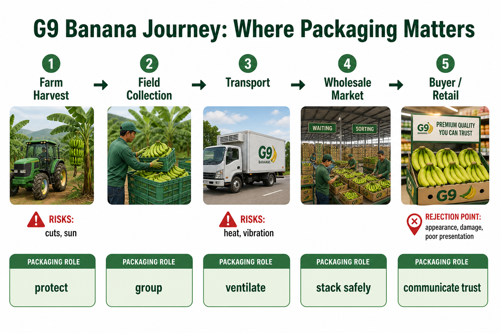
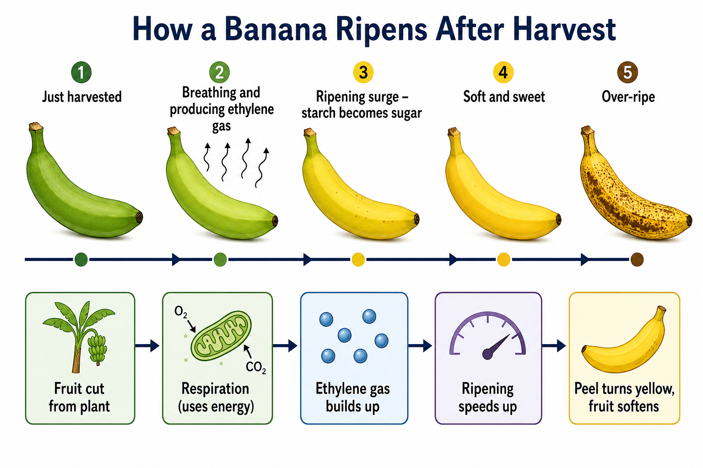
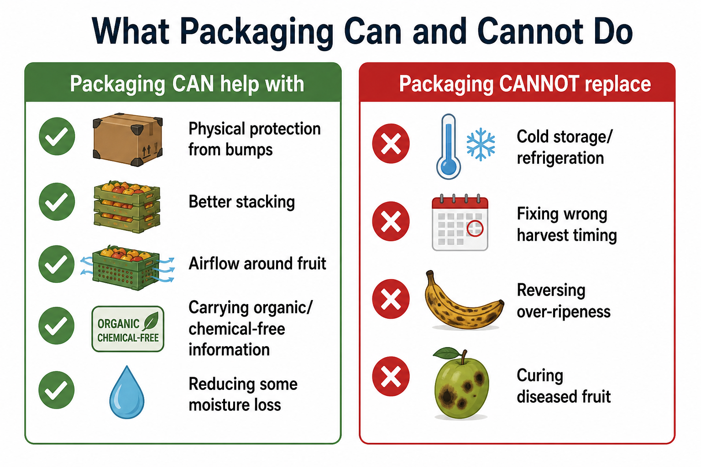
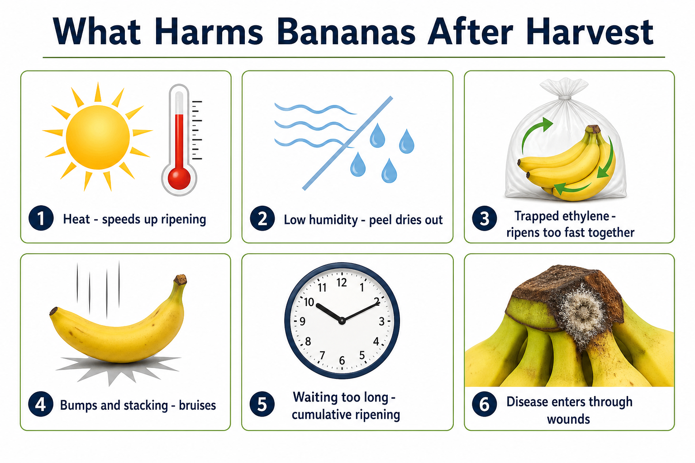
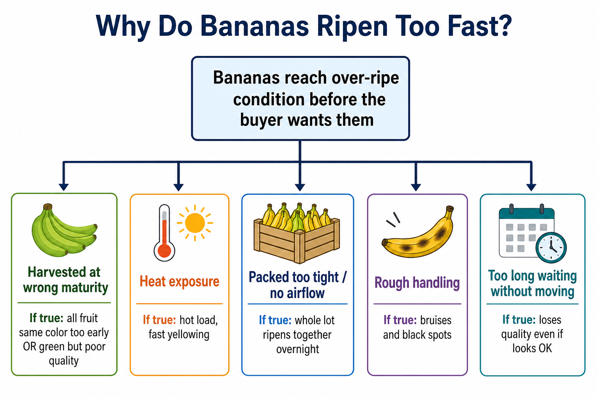
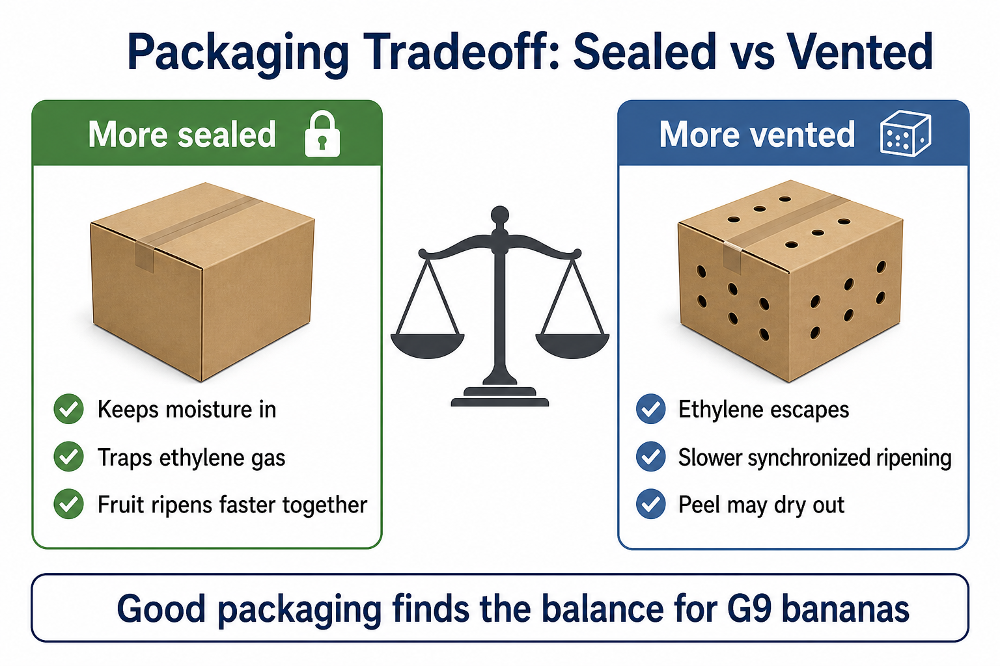

# G9 Post-Harvest Functional Brief

## Purpose of This Document

This brief explains how G9 bananas behave after harvest, what causes quality loss in ordinary storage and transport, and what a packaging solution can realistically be asked to do. It is written for readers who have not studied biology or food science. Every section connects to the packaging design problem: **how do we help G9 bananas stay saleable for longer under ambient conditions, while communicating organic or chemical-free trust to the buyer?**

This document does not specify a final package design or biomaterial choice. It establishes the biological and supply-chain facts that those decisions must respect.

---

## 1. What is G9?

**G9** is the Indian trade name for **Grand Nain** (also written *Grand Naine*), a dessert banana of the **Cavendish** type. Botanically, it belongs to *Musa acuminata* AAA Group, Cavendish subgroup (cultivar Grand Nain). It is grown on a large scale through **tissue culture**, which means plants are raised from small laboratory-grown samples rather than from seed. This produces a uniform crop: similar size, similar ripening behaviour, and predictable market appeal.

In India, G9 is the **dominant export-grade Cavendish cultivar** in commercial G9 growing belts. India also grows substantial volumes of other types, such as Robusta and Nendran, which behave differently after harvest. Most G9 fruit is sold through **wholesale channels**: from farms to local markets (*mandis*), traders, and retail buyers. Unlike export shipments, which often use refrigerated transport, much of this domestic trade moves **without a continuous cold chain**. Bananas may sit in crates, on trucks, or in open storage for several days in warm conditions.

That commercial reality matters. G9 is harvested while still green and firm so it can survive handling and transport. But once picked, the fruit does not stop living. It continues its internal ripening programme. For anyone designing packaging, the starting point is simple: **G9 is a living product on a clock**, and that clock runs faster when temperature, air, and handling work against it.



*Figure 1. The journey of G9 bananas from harvest to buyer. Packaging is most relevant during transport, wholesale holding, and buyer receipt.*

---

## 2. The Ripening Engine

This is the most important section in the brief. If you understand how a banana ripens after harvest, every other decision in this project becomes easier to follow.

### 2.1 The fruit is still alive after harvest

A green G9 banana may look inactive, but inside it is a living system. Cells remain active. Water still moves between peel and flesh. Chemical changes continue. Harvest removes the fruit from the plant, but it does **not** switch ripening off.

Think of the banana as a passenger that has left the farm but is still running its own internal programme.

### 2.2 Respiration: the fruit is "breathing"

Like other living tissue, banana cells carry out **respiration**. In plain terms, the fruit takes in oxygen and releases carbon dioxide, using stored energy to power its internal work.

A useful analogy: after harvest, the banana is like a person who still needs to breathe and eat from stored reserves, even while sitting in a crate. The warmer the surroundings, the faster this breathing tends to run.

For packaging, respiration matters because faster breathing usually means faster ripening, more heat, and quicker use of the fruit's stored reserves.

### 2.3 Ethylene: the ripening signal

Bananas produce a natural plant hormone called **ethylene**. Ethylene is a gas. It is invisible and odourless at normal levels, but it acts as a chemical message: *ripen now*.

In G9 and other Cavendish bananas, ethylene behaviour is especially important because the fruit is **climacteric**. That means ripening is not steady and slow. Instead, the fruit can shift into a rapid phase once ethylene builds up.

A key feature of ethylene in bananas is that it becomes **self-reinforcing once ripening begins**. During the climacteric rise, a small amount of ethylene can trigger the fruit to make more ethylene. Nearby bananas can also influence one another, because the gas can move through the air inside a crate or bag. One ripening finger can encourage others to follow.

### 2.4 The climacteric surge

The **climacteric** is the sharp turning point in a banana's post-harvest life. Before this stage, respiration is relatively low and change is gradual. During the climacteric, both **ethylene production** and **respiration rate** rise steeply, often within a short period.

In commercial practice, G9 is harvested while still green but physiologically mature. For longer-distance trade, harvest is often at around **75–80% maturity** so traders retain green life before ripening begins. For very short local routes, fruit may be picked slightly later. Once the climacteric is fully under way, ripening cannot be reversed. The fruit is committed to the yellow, soft, sweet stage, and beyond.

### 2.5 What changes during ripening

During the climacteric surge, several visible and sensory changes happen together. They are driven by enzymes (natural biological catalysts) breaking down and rebuilding compounds inside the fruit.

| Change | What you can observe | What is happening inside |
|--------|----------------------|--------------------------|
| Colour | Peel turns from dark green to light green, then yellow | Green chlorophyll in the peel breaks down, revealing yellow pigments underneath |
| Taste | Fruit becomes noticeably sweeter | Starch is converted into sugars such as sucrose, glucose, and fructose |
| Texture | Flesh softens; peel may become easier to split | Cell walls weaken; water and sugars shift within the tissue |
| Aroma | Characteristic banana smell develops | Volatile aroma compounds are produced as ripening advances |
| Weight | Fruit may feel slightly lighter | Some moisture is lost to the surrounding air |

Unripe G9 bananas are starchy and firm. Ripe ones are sweet and soft. That transformation makes the fruit edible and marketable. It also sets a deadline.



*Figure 2. The ripening engine: from harvest through respiration and ethylene to visible changes in colour, texture, and taste.*

### 2.6 Why this matters for packaging

Packaging cannot cancel biology. A living banana will ripen. Good packaging works **with** that reality by managing conditions around the fruit:

- **Speed:** Warm storage accelerates respiration and ripening. Cooler conditions can slow the process, but G9 is sensitive to cold injury when held for extended periods below roughly 12–13 °C, so "make it cold" is not a simple fix for traders without proper refrigerated equipment and temperature control.
- **Air and ethylene:** Closed packaging without ventilation can trap ethylene and speed group ripening. Controlled ventilation or ethylene management can help keep ripening more uniform.
- **Damage:** Bruised or crushed tissue respires faster and ripens unevenly. Packaging that reduces compression and vibration protects the ripening process from being thrown off balance.

The goal is not to stop nature. It is to **guide** ripening so more fruit arrives in a saleable condition.

---

## 3. How Quality Deteriorates

| What people see | What is happening underneath |
|-----------------|------------------------------|
| Green fruit turns yellow too quickly or unevenly within a lot | Ethylene has triggered the climacteric in some fingers before others; temperature or crowding may be uneven |
| Brown or black marks on the peel, especially at rubbed or scuffed spots | Surface cells are damaged; water escapes faster from injured peel, and pigments oxidise, turning the area dark |
| Soft, mushy patches while the peel still looks mostly intact | **Impact bruising**: internal flesh cells are ruptured even when the skin is unbroken; damaged tissue ripens and breaks down faster |
| Split or cracked peel, often during active ripening | Internal pressure rises as sugars accumulate and water moves; if humidity is very high or ripening is rapid, the peel can fail before the flesh is ready |
| Dry, dull, or grey-looking peel | Moisture loss and, in some cases, cold injury from exposure to temperatures that are too low for banana tissue |
| Brown flesh when cut open | Advanced ripening, bruising, chilling injury, or entry of decay organisms through wounds |
| Fingers detach easily from the bunch ("finger drop") | Natural weakening at the crown as the fruit ages; worsened by rough handling or overripe senescence |
| Fuzzy or sunken dark lesions, often near wounds | Fungal infection, commonly **anthracnose**, entering through crown damage, cracks, or abrasions |
| Fruit feels lighter than at harvest | **Physiological weight loss**: ongoing water vapour loss from peel to surrounding air |
| Whole shipment arrives overripe or unsaleable | The ripening engine ran too fast, often due to heat, trapped ethylene, delays in transit, or poor maturity at harvest |

---

## 4. What Packaging Cannot Fix

Honest limits are part of good design. Packaging can improve conditions, but it cannot rewrite plant biology or correct upstream mistakes.



*Figure 3. Packaging is a quality-management tool, not a substitute for cold storage, correct harvest timing, or disease treatment.*

**Packaging cannot stop ripening indefinitely.** G9 is a climacteric fruit. Once ripening is initiated, the process moves forward. Packaging may slow or steer it; it cannot freeze a banana in a permanently green, starchy state without specialised cold-chain systems that many wholesale routes do not have.

**Packaging cannot reverse damage already done.** Bruises, crown cuts, insect injury, and fungal infection begin before the box is sealed. A wrapper can reduce further harm, but it cannot heal broken cells or remove decay that has already started.

**Packaging cannot replace careful harvest and handling.** If fruit is harvested too immature or too advanced, dropped, over-stacked, or left in hot sun, quality is compromised before packaging begins. No material compensates for rough treatment.

**Packaging cannot guarantee uniform ripening on its own.** Ethylene sensitivity varies with maturity, temperature, and position in the crate. Without attention to venting, stacking, and ripening management, some fingers will always race ahead of others.

**Packaging cannot prove food safety or organic status by itself.** A biodegradable bag may reduce plastic waste or protect fruit, but trust claims about chemical-free or organic production require verified farm practices and traceability, not packaging alone.

**Packaging cannot ignore temperature limits.** Bananas need protection from heat, but they are also vulnerable to cold injury. Simply "keeping them cool" in a non-refrigerated wholesale chain is not enough if temperatures fall too low or swing unpredictably.

**Packaging cannot eliminate post-harvest losses entirely.** Published estimates for banana supply chains in India often cite sector-wide losses in the range of **30–40%** across the value chain. This is a literature estimate for bananas in general, not a G9-specific figure validated for this project's route. The exact loss rate varies by region, supply-chain stage, and measurement method. Better packaging addresses only the portion of loss caused by handling, microclimate, and pack-related factors.

The practical aim is narrower and more realistic: **reduce avoidable loss, slow uncontrolled ripening, and protect fruit during the journey from farm to buyer.**

---

## 5. What Harms Bananas After Harvest

G9 bananas are **climacteric fruit**: after harvest they continue to ripen on their own. In India, most bananas move through the supply chain at **ambient temperature**, without reliable cold storage or refrigerated transport on every leg. Under these conditions, post-harvest losses for banana are commonly reported at **30–40%** across the value chain. This is a literature estimate for the banana sector in general, not a G9-specific figure validated for this project's route, and not a loss that packaging alone can address.

The six causes below describe what harms bananas from the moment they are cut from the plant until they reach the buyer.



*Figure 4. The six main post-harvest enemies and their effect on G9 bananas.*

### 5.1 Heat

| | |
|---|---|
| **Mechanism** | Warm air speeds up the fruit's internal chemistry. The banana "breathes" faster, produces more ethylene, and converts starch to sugar more quickly. In Indian summers and inside closed vehicles, temperatures can rise well above comfortable room temperature. |
| **Visible symptoms** | Faster colour change from green to yellow; softening earlier than expected; skin may develop brown patches; fruit feels warm to the touch after transport. |
| **Packaging relevance** | **Partly.** Packaging can provide some shade and reduce direct sun exposure, but it cannot fully replace cooling. Without cold chain, heat remains a major risk. |

### 5.2 Dry Air

| | |
|---|---|
| **Mechanism** | Bananas lose water through their skin. In low-humidity conditions, moisture leaves the fruit faster than it can be replaced. The fruit becomes stressed, which can also trigger faster ripening. |
| **Visible symptoms** | Weight loss; skin looks dull or slightly shrivelled; tips of fingers may darken; flesh feels less firm even if colour looks acceptable. |
| **Packaging relevance** | **Yes.** Film or bag packaging can hold humidity around the fruit, provided ventilation is also managed. |

### 5.3 Trapped Ethylene

| | |
|---|---|
| **Mechanism** | Bananas release ethylene gas as they ripen. Ethylene is both a signal and an accelerator: one ripe banana can cause others nearby to ripen faster. In a **closed, unventilated** pack, ethylene builds up and ripens the whole lot unevenly and too quickly. |
| **Visible symptoms** | Uneven ripening within the same box (some yellow, some still green); sudden softening of the whole batch; shortened green life before sale. |
| **Packaging relevance** | **Yes.** Packaging design must **manage** ethylene, not trap it. Ventilation holes, permeable film, or ethylene-absorbing sachets are established approaches. A fully sealed bag without vents can make the problem worse. |

### 5.4 Mechanical Damage

| | |
|---|---|
| **Mechanism** | Pressure, impact, and rough handling break cells under the skin. Damaged tissue leaks fluids, loses moisture, and produces extra ethylene as a stress response. Even damage that is not visible at first can cause faster ripening and rot later. |
| **Visible symptoms** | Bruises (brown soft patches); crushed or flattened fingers; crown damage; cracks in the skin; fruit that looks fine at loading but fails at the mandi. |
| **Packaging relevance** | **Yes.** Rigid outer structure, inner cushioning, crown protection, and proper stacking design directly address this problem. |

### 5.5 Extended Dwell Time

| | |
|---|---|
| **Mechanism** | "Dwell time" means how long the fruit sits in one place: at the farm gate, in a trader's godown, at the mandi, or waiting for transport. Every extra hour at ambient temperature gives heat, dry air, ethylene, and microbes more time to act. Ripening does not pause while bananas wait. |
| **Visible symptoms** | Fruit arrives already yellow when the buyer wanted green; over-ripe stock at the back of a pile; higher rejection rates after delays. |
| **Packaging relevance** | **Partly.** Good packaging can **buy time** by slowing ripening and protecting quality, but it cannot remove the need for timely movement. |

### 5.6 Disease and Mold

| | |
|---|---|
| **Mechanism** | Fungi and bacteria enter through wounds, especially at the crown (where the bunch was cut from the plant) or through bruises. Warm, humid conditions favour growth. Crown rot is a well-documented problem for G9 in Indian supply chains. |
| **Visible symptoms** | White, grey, or black fungal growth; soft wet patches; sour or fermented smell; blackening at the crown; spread from one finger to others in contact. |
| **Packaging relevance** | **Partly.** Packaging can reduce crown exposure, maintain cleaner conditions, and control humidity, but it cannot cure infection that started before packing. |

### Summary

| Enemy | Can packaging help? |
|-------|---------------------|
| Heat | Partly |
| Dry air | Yes |
| Trapped ethylene | Yes |
| Mechanical damage | Yes |
| Extended dwell time | Partly |
| Disease / mold | Partly |

**Key takeaway:** Packaging is not just a container. For G9 bananas in India's ambient supply chain, it is a **quality-management tool**, but only if it is designed for ventilation, moisture balance, protection, and the real conditions of farm-to-market transport.

---

## 6. Why Bananas Ripen Too Fast: A Hypothesis Tree

### Starting symptom

**Bananas reach over-ripe or saleable condition before the buyer wants them.**

The buyer expected fruit that would stay green (or lightly ripening) for a defined number of days. Instead, the shipment is already yellow, soft, or uneven, reducing price, causing rejection, or forcing a rushed sale.

This is not one single failure. It is the result of one or more causes acting together. The tree below turns the symptom into **testable hypotheses**: for each possible cause, we ask what evidence we would expect to see, and whether packaging could address it.



*Figure 5. Possible causes of over-rapid ripening and whether packaging can address each one.*

### Branch A: Wrong harvest maturity

| | |
|---|---|
| **Hypothesis** | Bananas were already too mature when harvested. |
| **If true, you would see…** | Short green life even with careful handling; rapid yellowing within one to two days; full fingers with rounded edges and lighter green colour at harvest. |
| **Packaging link** | **No.** Packaging cannot reverse fruit that was picked too late. This is a harvest-timing decision. |

### Branch B: Heat exposure

| | |
|---|---|
| **Hypothesis** | Bananas were stored or transported in high temperature: open sun, hot vehicle, unshaded godown. |
| **If true, you would see…** | Fruit warm on arrival; faster colour change than expected for the number of days in transit; brown patches on sun-exposed sides. |
| **Packaging link** | **Partly.** Reflective or insulated outer packaging and shade during loading can reduce heat load. Full control requires cooling, which is often unavailable. |

### Branch C: Enclosed packing (ethylene buildup)

| | |
|---|---|
| **Hypothesis** | Fruit was packed in a closed system with poor ventilation, so ethylene accumulated and triggered mass ripening. |
| **If true, you would see…** | Fruit at the centre of the pack more ripe than fruit at the edges; whole batch ripening faster than unpackaged control; improvement when vents or ethylene absorbers are added. |
| **Packaging link** | **Yes.** This is a core packaging design variable. Research on Grand Naine supports ventilated polyethylene rather than fully sealed bags at ambient temperature. |

### Branch D: Rough handling

| | |
|---|---|
| **Hypothesis** | Bruising and crown damage during harvest, loading, stacking, or unloading accelerated ripening through stress ethylene and tissue breakdown. |
| **If true, you would see…** | Bruises at points of contact or impact; crown damage visible at the top of the bunch; damage concentrated at the bottom of the stack. |
| **Packaging link** | **Yes.** Cushioning, rigid structure, crown guards, and load-height limits are packaging and handling-design responses. |

### Branch E: Long waiting (extended dwell time)

| | |
|---|---|
| **Hypothesis** | Bananas spent too long in one location before reaching the buyer. |
| **If true, you would see…** | Ripening stage inconsistent with stated transit time alone; records showing multi-day delays; worse outcomes after market closures. |
| **Packaging link** | **Partly.** Packaging that slows ripening extends the safe waiting period, but cannot eliminate the cost of long delays indefinitely. |

### Branch F: Pre-existing damage or disease

| | |
|---|---|
| **Hypothesis** | Some fruit entered the pack already wounded or infected. |
| **If true, you would see…** | Rot starting at the crown or wound sites independent of ripening pattern; mould visible before general yellowing. |
| **Packaging link** | **Partly.** Packaging can protect the crown and reduce secondary spread, but cannot repair fruit that was already compromised. |

### How to use this tree

1. **Start at the symptom** — document what the buyer received versus what was expected (colour, firmness, days of green life).
2. **Walk each branch** — mark which "if true, you would see" statements match the actual shipment.
3. **Prioritise packaging interventions** on branches marked **Yes** or **Partly** where the evidence fits.
4. **Do not blame packaging alone** for branches marked **No** — wrong maturity and pre-packing disease require upstream changes.

| Branch | Cause | Packaging can address? |
|--------|-------|------------------------|
| A | Wrong harvest maturity | No |
| B | Heat exposure | Partly |
| C | Enclosed packing / ethylene buildup | Yes |
| D | Rough handling | Yes |
| E | Long waiting | Partly |
| F | Pre-existing damage / disease | Partly |

**Working hypothesis for this project:** In India's ambient farm-to-market chain, over-rapid ripening is most likely driven by a **combination** of ethylene buildup, moisture loss, and mechanical damage, with heat and dwell time as amplifying factors. The packaging prototype should be tested against branches C, D, and B first, while harvest maturity and crown health are recorded as control variables in every trial.

---

## 7. Supply Chain Journey

This section follows a G9 banana from harvest to retail preparation, with emphasis on what happens to the **package** at each stage.

G9 is a climacteric Cavendish cultivar: it continues to ripen after harvest, produces ethylene, and is sensitive to heat, compression, and moisture loss. In India, export-grade fruit often moves through cold chain and corrugated fibreboard boxes; much domestic fruit moves through ambient channels with simpler packs (open crates, gunny sacks, or basic poly bags). **This project targets the ambient, packaging-dependent leg of that journey.**

| Stage | Typical conditions (ambient India) | Main risks to fruit and pack | Packaging opportunity |
|-------|-----------------------------------|------------------------------|------------------------|
| **Harvest** | Field temperature often 28–38 °C; fruit cut at 75–80% maturity (green, edges rounded) | Crown damage, latex staining, finger bruising, sun exposure | Pack designed to receive fruit soon after harvest; crown protection |
| **Field aggregation** | Fruit collected at farm edge; wait time 2–8 hours before loading | Heat buildup, ethylene in piles, weight crushing lower layers | Ventilated outer structure; separation of hands to reduce bruising |
| **Transport** | Open or partially covered trucks; no refrigeration on many domestic routes; summer stack temperatures commonly 30–40 °C | Accelerated ripening, softening, sweating inside sealed bags, compression | Rigid pack with stackability; controlled ventilation; cushioning at contact points |
| **Wholesale (mandi)** | Covered or open yards; high humidity; fruit sorted and re-piled; hold time 12–72 hours | Re-handling bruises, ethylene from surrounding produce, rejection of over-ripe lots | Pack survives multiple lifts; ventilation maintained after opening; quality visible for grading |
| **Buyer (agri-business)** | Receives graded lots; may hold in warehouse; ambient storage unless cold chain available | Lot rejection if ripening is uneven, crown rot present, or bruising exceeds threshold | Pack that extends acceptable green-to-yellow window; trust marker for organic/chemical-free claims |
| **Retail prep** | Ripening rooms in organised retail; many outlets sell from ambient display | Over-ripening on shelf, poor appearance, trust gap if organic claim cannot be verified | Display-friendly format; trust communication legible at point of sale |

**Linear flow (packaging lens):**

```
Harvest → Field aggregation → Transport → Wholesale → Buyer → Retail prep
   |            |                  |            |          |
 crown/      heat +            stack +      re-handle   lot accept
 bruise       ethylene           vibration    reject
```

**Reference context:** Export supply chains use perforated corrugated boxes, perforated polyethylene liners, ethylene absorber sachets, and **13–14 °C** refrigerated transport. Domestic ambient chains rarely achieve this. Packaging must compensate for part of that gap, but cannot replicate cold-chain performance.

---

## 8. What We Can and Cannot Control

### Three buckets of control

| Cannot control | Can influence with adoption | Package can directly address |
|----------------|----------------------------|------------------------------|
| Ambient air temperature during open transport | Buyer willingness to pay for better packs | Physical protection from compression and vibration |
| Distance from farm to market | Farmer/trader packing discipline (time from harvest to pack) | Ventilation rate vs ethylene and CO₂ buildup |
| Behaviour of other produce releasing ethylene nearby | Wholesale handling practices (minimise re-piling) | Moisture retention to reduce weight loss |
| Road quality and driver stacking habits | Training on harvest maturity and crown care | Visible quality presentation for grading |
| Mandi infrastructure (shade, flooring) | Adoption of trust/verification standards by buyer | On-pack organic/chemical-free trust communication |
| Cold chain availability and cost | End-of-life collection or composting behaviour | Material choice and disposal pathway |

### Packaging influence map

| Stressor | Influence level | Notes |
|----------|-----------------|-------|
| Mechanical bruising and finger damage | **Strong** | Rigid structure, hand separation, crown clearance |
| Compression during truck stacking | **Strong** | Box rigidity, load-bearing corners, weight limits |
| Ethylene accumulation inside pack | **Strong** | Vent area, permeable film, optional absorber sachet |
| Moisture loss (shrivelling, weight loss) | **Some** | Partial barrier film; balance with ventilation need |
| Heat exposure (summer transport) | **Some** | Light colour, ventilation; cannot cool |
| Crown rot (fungal entry at crown) | **Some** | Crown protection, drainage; pre-pack treatment often required |
| Organic/chemical-free trust gap | **Strong** | Dedicated trust feature on pack (indicator, QR, certification mark) |
| Chilling injury | **None** | Occurs below ~12.8 °C; not relevant to ambient pack design |
| Illegal ripening agents | **None** | Requires chain-of-custody and enforcement, not packaging alone |

**Summary:** Packaging is strongest on physical protection and airflow around the fruit. It is weak on temperature unless the whole chain is cool. Design must work within that boundary.

---

## 9. What the Package Needs to Do

These are **design inputs**: what the package must *do*. They are not a finished design specification.

### Protect

**In plain terms:** Keep the fruit from being squashed, knocked, and scraped from farm to buyer.

**Problem it addresses:** G9 bruises easily. Open crates and gunny sacks allow direct stacking. Compression and vibration during transport are major loss drivers.

**Design input:** Load-bearing outer shell; defined maximum stack height; internal spacing so fingers do not bear weight from fruit above.

### Breathe

**In plain terms:** Let the pack release enough ripening gas so the fruit does not ripen too fast together, without drying the peel out.

**Problem it addresses:** G9 produces and responds to ethylene. A fully sealed bag without ventilation traps ethylene and accelerates ripening.

**Design input:** Defined vent area or permeability; optional pocket for ethylene absorber sachet; avoid assuming "sealed = better" without testing.

### Handle

**In plain terms:** Make the pack easy and safe to lift, carry, load, and unload.

**Problem it addresses:** Rough handling at field aggregation and wholesale causes crown tears and impact bruising.

**Design input:** Hand-holds or cut-outs; stable footprint for truck loading; weight aligned with common wholesale unit (often 10–13 kg fruit per box in organised trade).

### Display quality

**In plain terms:** Let the buyer see enough of the fruit to judge colour, size, and condition without unpacking the entire lot.

**Problem it addresses:** Wholesale rejection often follows visual grading: uneven ripeness, skin defects, latex marks, crown condition.

**Design input:** Partial visibility window or easy partial opening; uniform hand orientation inside pack.

### Communicate trust (organic / chemical-free)

**In plain terms:** Give the buyer a clear signal that the fruit meets organic or chemical-free claims.

**Problem it addresses:** Organic premium is hard to confirm at mandi. Undisclosed post-harvest treatment undermines trust. Packaging is the physical touchpoint where a **trust signal** can travel with the fruit.

**Design input:** Trust feature that survives humid storage (indicator, tamper-evident seal, certification reference, batch trace code). **Important:** the on-pack element supports a buyer-facing claim; it is not NPOP organic certification, residue testing, or proof that fruit was grown without pesticides. Calcium carbide ripening and crown fungicide treatment, if present upstream, cannot be undone by a label.

### End-of-life

**In plain terms:** After use, the pack should not create a disposal problem that contradicts the product's sustainability story.

**Problem it addresses:** Conventional plastic packs perform well but conflict with biodegradability goals. Bio-plastic must still meet strength and food-contact requirements.

**Design input:** Material selection with documented composting or disposal pathway; honest labelling so users know how to dispose.

---

## 10. The Sealed vs Vented Tradeoff

G9 bananas are **climacteric**: after harvest they respire, produce ethylene, and ripen whether or not they remain attached to the plant. Packaging sits on a sliding scale between two failure modes.



*Figure 6. The central design tension: sealed packs trap ripening gas; open packs lose moisture and protection.*

### Why sealed packs tempt designers, and why they often fail for bananas

A sealed pack seems logical: it keeps dirt out, holds humidity, and looks "protected." For climacteric fruit, however, a tight seal traps **ethylene**. Inside a sealed bag on a hot truck, temperature and ethylene concentration rise together. The fruit can pass from green to over-ripe faster than in open air.

Sealed modified-atmosphere packs *can* extend life, but only with precise film thickness, perforation, or active absorbers, and often with cold chain. At ambient Indian summer temperatures, a sealed pack without engineering is a common failure mode.

### Why fully open packs also fail

Open crates and gunny sacks allow ethylene to dissipate but expose fruit to **rapid moisture loss**, dust, insect contact, and direct compression. G9 loses saleable weight and appearance through shrivelling and bruising.

### The design tension

| Factor | More sealed | More vented |
|--------|-------------|-------------|
| Ethylene buildup | Worse | Better |
| Moisture retention | Better | Worse |
| Heat buildup in truck | Often worse (greenhouse effect in clear film) | Better air exchange |
| Physical protection | Better if structure is rigid | Worse unless outer box is strong |
| Trust feature durability | Easier to protect label/indicator | Exposure to humidity and handling |

**In one sentence:** The pack must hold enough humidity to keep G9 firm and presentable, yet release enough ethylene and heat to avoid a premature ripening spike, all without the temperature control that export cold chains provide.

**Project implication:** The bio-plastic prototype must be tested as a **vented or permeability-controlled** system, not assumed to work as a hermetic seal. The correct answer is unlikely to be "maximum seal" or "fully open"; it is a tested balance point for ambient India.

---

## 11. Open Questions Register

Questions that must be resolved before packaging requirements can be locked. Status reflects current project knowledge.

| Question | Status | Why it matters for packaging |
|----------|--------|------------------------------|
| Harvest-to-buyer days on the target route (farm → mandi → agri-business) | **Must test** | Defines required green-life extension; a two-day route needs a different vent rate than a five-day route |
| Current pack type used by partner farmers/traders (crate, gunny, LDPE, corrugated box, none) | **Must test** | Baseline for comparison trials; identifies which functions are currently missing |
| Buyer rejection criteria (colour stage, bruise percentage, crown rot tolerance) | **Must test** | Acceptance tests must mirror real rejection thresholds |
| Summer truck temperatures (stack centre vs cabin) on target route | **Must test** | Vent area and material assumptions; sealed packs fail differently at 35 °C than at 25 °C |
| Sealed vs vented failure mode under local conditions: over-ripeness or shrivel/bruise first? | **Must test** | Determines whether design prioritises ethylene venting or moisture retention |
| Typical wholesale hold time at mandi before buyer pickup | **Estimate** (12–72 hours from literature) | Pack must survive re-handling and short-term storage |
| Whether target buyer requires on-pack verification vs batch documentation for organic/chemical-free claims | **Must test** | Trust feature format (visual indicator vs code vs certificate reference) |
| End-of-life pathway available to users (municipal compost, farm compost, landfill) | **Estimate** | Bio-plastic material and labelling requirements |
| G9 ambient shelf life without treatment | **Known from literature** (variable; depends on maturity and conditions) | Sets lower bound for improvement target |
| G9 green life with export cold chain (13–14 °C) | **Known from literature** (several weeks) | Upper bound; not achievable without refrigeration |
| Whether ambient packaging can extend saleable life vs current baseline pack | **Hypothesis — must test** | Any shelf-life claim requires comparison against current pack, defined quality threshold, and test duration |

### What this project does and does not claim

| Under ordinary ambient storage/transport | Explicitly not claimed |
|------------------------------------------|------------------------|
| Slower uncontrolled ripening through ventilation, protection, and moisture balance | Export cold-chain green life (weeks at 13–14 °C) |
| Reduced bruising and stack damage vs open crate or gunny | Reversal of harvest-timing mistakes or pre-existing disease |
| Buyer-facing trust signal for organic/chemical-free positioning | Independent proof of organic certification or zero chemical residue |
| Extension of saleable window — **to be validated in prototype testing** | Elimination of all post-harvest loss across the chain |

### Stakeholders affected by packaging design

| Stakeholder | How packaging matters to them |
|-------------|------------------------------|
| Farmers | Fewer downgraded or rejected fingers if fruit arrives in better condition |
| Handlers and transporters | Easier lift, stack, and load; less damage during movement |
| Wholesale buyers and agri-businesses | Longer acceptable hold time; clearer grading; trust signal at receipt |
| Retailers and consumers | Better appearance at display; fruit that lasts longer after purchase |
| Project team and advisors | Testable prototype requirements grounded in biology and chain reality |

---

## 12. How This Brief Feeds the Packaging Design

Every section above points toward specific design decisions that will be made in the next phase of the project:

| Understanding from this brief | Packaging decision it informs |
|-------------------------------|-------------------------------|
| G9 is climacteric and ethylene-driven | Ventilation or permeability strategy, not a fully sealed pack |
| Mechanical damage accelerates ripening | Rigid structure, cushioning, crown protection, stack limits |
| Ambient transport is the primary use case | Design for heat and ethylene at ordinary temperatures, not cold-chain specs |
| Moisture loss and ethylene buildup compete | Bio-plastic film gauge, vent area, and balance testing |
| Trust feature is required | On-pack communication design that survives humid storage |
| Many losses start before packing | Honest claims about what the prototype can and cannot fix |
| Open questions on route, rejection criteria, and baseline pack | Test protocol for prototype validation (next milestone) |

The next phase of the project is **bio-plastic material research**: identifying materials that can meet the functions listed in Section 9 within the tradeoff described in Section 10.

---

## References and Further Reading

1. FAO / post-harvest horticulture literature on banana (*Musa acuminata* AAA Group, Cavendish subgroup) storage and ripening physiology.
2. Indian research on Grand Naine (*cv.* Grand Nain) ethylene treatment and ambient ripening (e.g. College of Horticulture, Rajendranagar studies on ethylene concentration and pulsing).
3. Supply chain and post-harvest loss studies: banana marketing channels in Gujarat and Tamil Nadu (wholesale loss estimates, lack of packing materials at intermediary level).
4. APEDA-aligned export packaging specifications for Cavendish bananas (perforated corrugated boxes, perforated polyethylene liners, ethylene absorber sachets, 13–14 °C transport) as benchmark, not as ambient domestic target.
5. Studies on post-harvest packaging materials and shelf-life of Grand Naine under ambient conditions.

*Note: Shelf-life figures cited in export and laboratory studies apply under controlled conditions. Any performance claim for the project prototype must be validated under the actual ambient route and handling conditions described in the Open Questions Register.*
