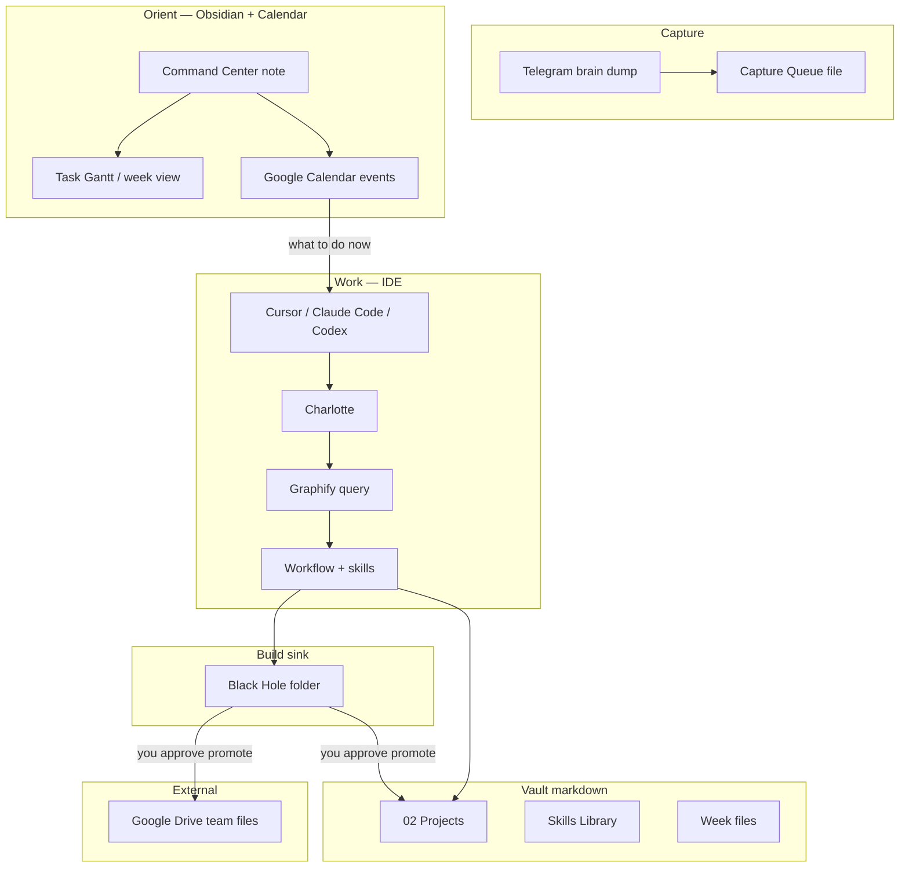
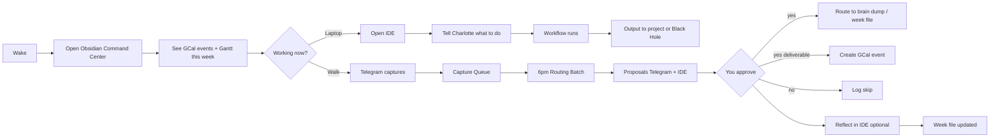
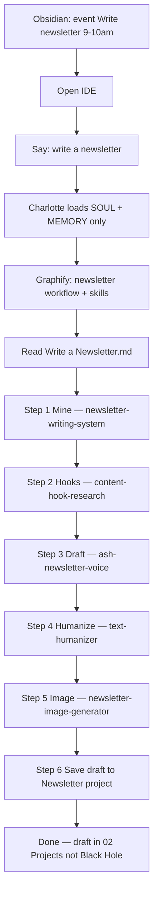

# Charlotte User Journeys

Companion to `charlotte-rebuild-spec.md`. Read this when asking "what do I actually do?"

---

## System map (you ↔ surfaces)

---

## Daily loop (typical day)

---

## Work session — write a newsletter (example)

**Copy / poster (shorter path):** no full workflow file — Charlotte loads `direct-response-copy` or `short-form-content` + project brain dump. Same IDE session pattern.

**Webinar:** trigger `Launch a Webinar Funnel` workflow → phase 1 uses `webinar-planning` → subsequent phases chain webinar-* skills per project intro.

**Manus deck build:** Manus writes to `Black Hole/udyaan-deck-YYYY-MM-DD/`. You review in Obsidian link or filesystem. Evening batch may propose "promote to Drive" — you approve.

---

## What you touch vs what runs itself

| You do | System does on **git commit** |
|---|---|
| `git commit` / push | **Sync hook** → `vault-index.json` + Graphify `--update` |
| Telegram while walking | Append Capture Queue |
| Open Obsidian morning | Show projects + timeline + calendar |
| Say what to work on in IDE | Read vault-index slice + Graphify + workflow only |
| `new project` in IDE | Template folder; sync after you commit |
| Approve 6pm proposals | Route captures, optional GCal events |
| Promote Black Hole → Drive/project | Manual or approve evening proposal |

**No watcher app.** Commit is the sync point. Optional 17:30 scheduled sync before 6pm batch.

| System never does without approval |
|---|
| Add calendar commitment |
| File capture to brain dump |
| Promote Black Hole artifact |
| Edit Patterns.md / MEMORY.md from daily capture |

---

## One question still open

**Command Center note location:** `00 Command Center.md` at vault root vs inside `00 Self-Management/`? Spec assumes vault root for fastest Obsidian open.
